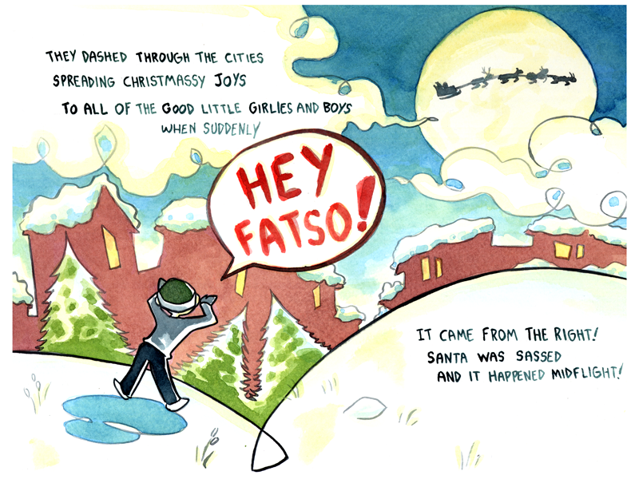
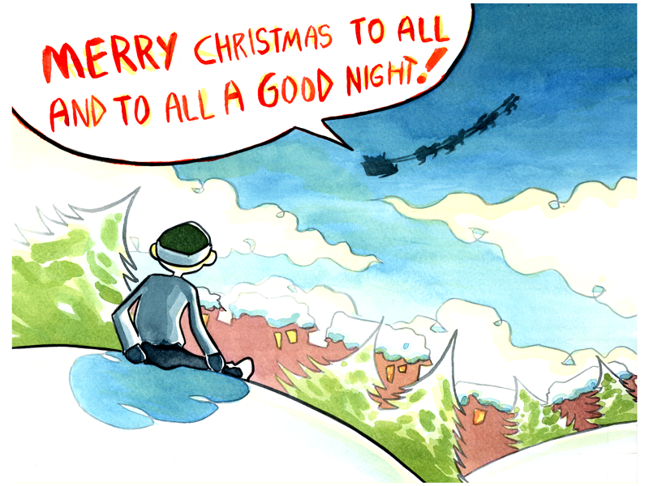

Ryan used watercolors for the images, employing a boxy, almost disheveled style. There's narrator-style text, written in a dark blue ink pen, but the characters also have speech bubbles with red text he painted. The speech bubbles intersperse with the text at times, as they are part of the verse. Instead of a single comic image with panels, Ryan broke each installment into separate images with panels. The title is "The Kid What Sassed Santa."

1. A cartoonish Santa flies his sleigh, seated as though he barely has control. Two of the visible reindeer have misaligned eyes. The text reads: "On Dasher, on Dancer, on... Whachamafoolit," he said with a stutter, forgetting their names. "On Larry, on Jimmy, on Stoney and Mudget." He was tipsy from drinks at the Old Reindeer Games. But the reindeer weren't bothered, they knew of his plight as they shot through the sky on that cold winter's night.
2. A landscape view of Santa silhouetted across the moon, flying over several red buildings with snow on their roofs. A boy stands on a hill near some pine trees, calling out. The text reads: They dashed through the cities spreading Christmassy joys to all the good little girlies and boys, when suddenly – (Hey Fatso!) – It came from the right! Santa was sassed and it happened midflight!
3. A view of Santa looking over the side of his sleigh, holding his hat in consternation. The text reads: He looked over his shoulder, thought, "Who could it be? Jack Frost may be sassed at times but not me!" He turned the sleigh 'round then surveyed the ground closely. He was in North Miltilton, full of good kids... well, mostly. He pulled out his list, which had been checked thrice. When – (You're a fat fat fatty!) – He'd not been sassed once, but twice!
4. Santa is on the ground, standing on the hill with pine trees, in front of the boy who mocks him. The text reads: Now the sound was much clearer so Santa began searchin' and he spied the whole town til' he found that rude urchin. (What's the meaning of this?) he said in a huff. – (You're a fat fatty fatso and you're not so tough! You're stupid and goofy and quite smelly too!) – More stinging remarks, what could ole Santa do?
5. A single panel, but combining two events. Santa pulls the boy over his knee and spanks him with his left hand. Then, a closer shot of him spanking the boy with his right hand, his eyes wild. The text reads: Why... he... spanked the boy good! As only he could. Then he spanked the boy gooder! Like the boy's parents should.
6. A wide shot of Santa spanking the boy a third time with more force. The boy cries out in pain. The text reads: Then he spanked the boy goodest! Cus Santa's the best! He left lumpy old coal as his gift to the pest. And as he flew off, he shouted in spite.
7. The boy sits on the hill, holding a hand on his butt as he looks out over the red houses. Santa, silhouetted against the sky, flies off and his speech bubble reads: Merry Christmas to all, and to all a good night!
