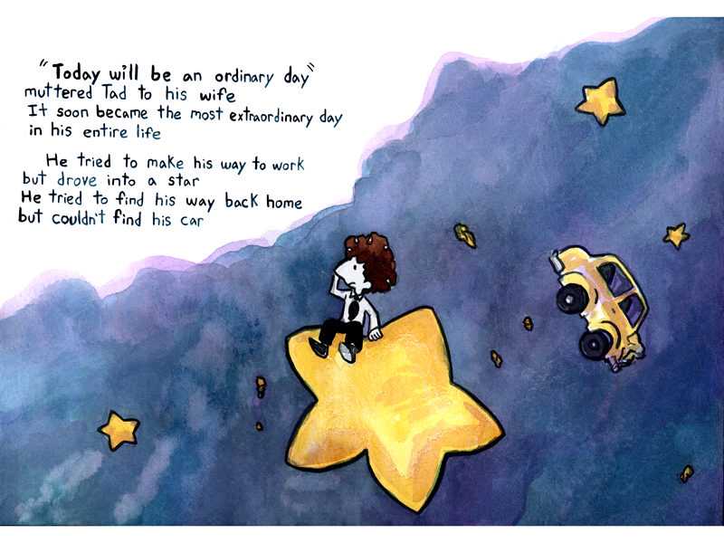
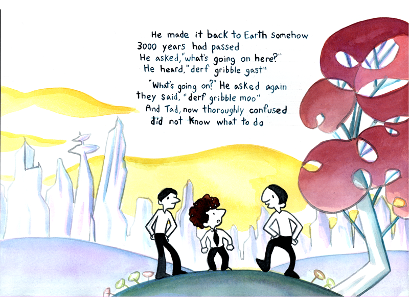
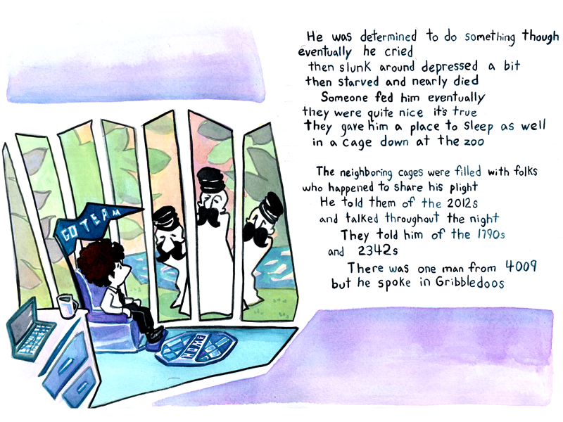
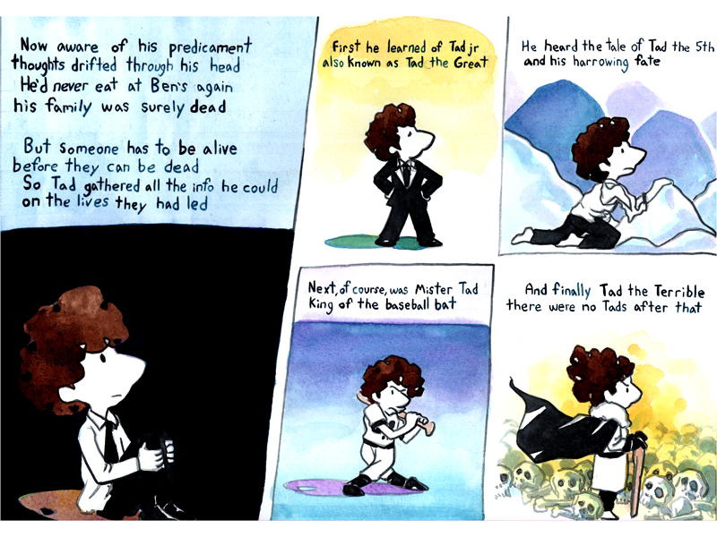
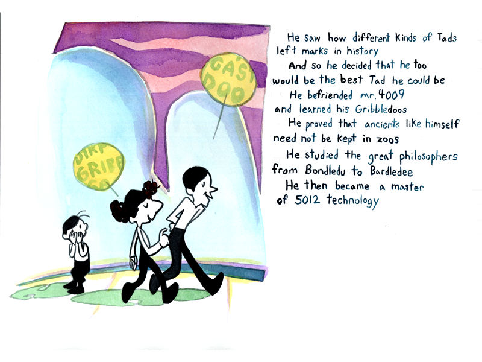
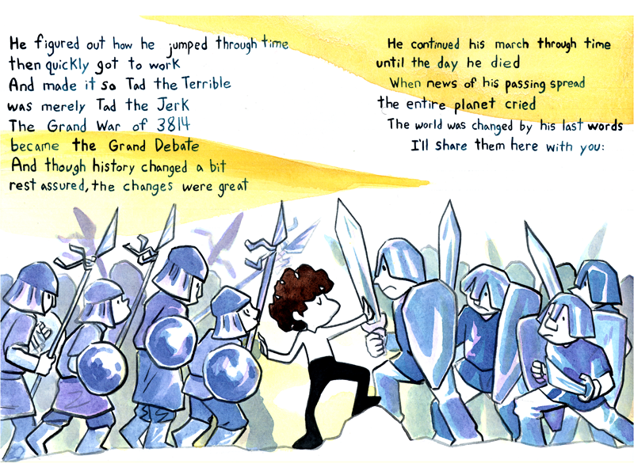
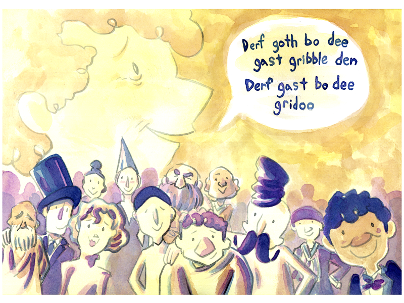

Ryan used lots of watercolors and his blue ink pen for the words in this comic. Some images are full panels, others are broken up into multiple panels.

1. A young man with a puff of brown hair, in a dress shirt with a black tie and black pants, sits on a cartoonish star in a field of purplish blue. He looks confused, and is holding the side of his head. Nearby are other stars and a taxicab style car which looks to have collided with something head-on. The text reads: "Today will be an ordinary day," muttered Tad to his wife. It soon became the most extraordinary day in his entire life. He tried to make his way to work but drove into a star. He tried to find his way back home but couldn't find his car.
2. Tad stands on an unfamiliar landscape, with strange flowers, jagged trees with circular leaves and perforations, and indistinct structures in the distance that could be buildings or bizarrely-carved rocks. Two people look at him, confused, and he appears alarmed. The text reads: He made it back to Earth somehow. 3000 years had passed. He asked, "What's going on here?" He heard, "Derf gribble gast." "What's going on?" he asked again. They said, "Derf gribble moo." And Tad, now thoroughly confused, did not know what to do.
3. Tad sits in a recliner, next to a dresser with a laptop and a mug of coffee, staring outside through thin slits as oddly-shaped people with black conductor hats and bushy mustaches look in at him. A rug on the floor has the word, "home," on it. The text reads: He was determined to do something though eventually he cried. Then slunk around depressed a bit, then starved and nearly died. Someone fed him eventually, they were quite nice it's true. They gave him a place to sleep as well, in a cage down at the zoo. The neighboring cages were filled with folks who happened to share his plight. He told them of the 2012s and talked through the night. They told him of the 1790s and the 2342s. There was one man from 4009 but he spoke in Gribbledoos.
4. Tad sits with his hands on his knees, looking up in darkness. The text reads: Now aware of his predicament, thoughts drifted through his head. He'd never eat at Ben's again, his family was surely dead. But someone has to be alive before they can be dead. So Tad gathered all the info he could on the lives they had led.
5. A confident version of Tad, in a fancy black suit. The text reads: First he learned of Tad Jr, also known as Tad the Great.
6. A destitute Tad in torn clothing, crawling over a rock. The text reads: He heard the tale of Tad the 5th and his harrowing fate.
7. A mean-looking Tad in a baseball uniform, swinging at a pitch. The text reads: Next, of course, was Mister Tad, king of the baseball bat.
8. An evil-looking Tad with wild hair, a flowing cloak, and a walking stick, surveying a field of skulls. The text reads: And finally Tad the Terrible. There were no Tads after that.
9. Two people walk past a child, with blue hills and a purple sky in the background. One person looks sort of like Tad, but with black hair. He has a yellow speech bubble with green text, with the words, "Dirp gripp so," somewhat visible. His companion has a similar speech bubble with the words, "Gast doo," somewhat visible. The text reads: He saw how different kinds of Tads left marks in history. And so he decided that he, too, would be the best Tad he could be. He befriended Mr. 4009 and learned his Gribbledoos. He proved that ancients like himself need not be kept in zoos. He studied the great philosophers from Bondledu to Bardledee. He then became a master of 5012 technology.
10. Tad stands amid two warring armies, peacefully. The text reads: He figured out how he jumped through time then quickly got to work. And made it so Tad the Terrible was merely Tad the Jerk. The Great War of 3814 became the Grand Debate. And though history changed a bit, rest assured, the changes were great. He continued his march through time until the day he died. When news of his passing spread the entire planet cried. The world was changed by his last words. I'll share them here with you.
11. A vision of an elderly Tad presents against a yellow sky. An amalgam of people look at the reader, including one of the mustachioed men from the zoo. Tad's words appear inside a speech balloon: "Derf goth bo dee gast gribble den. Derf gast bo dee gridoo."
