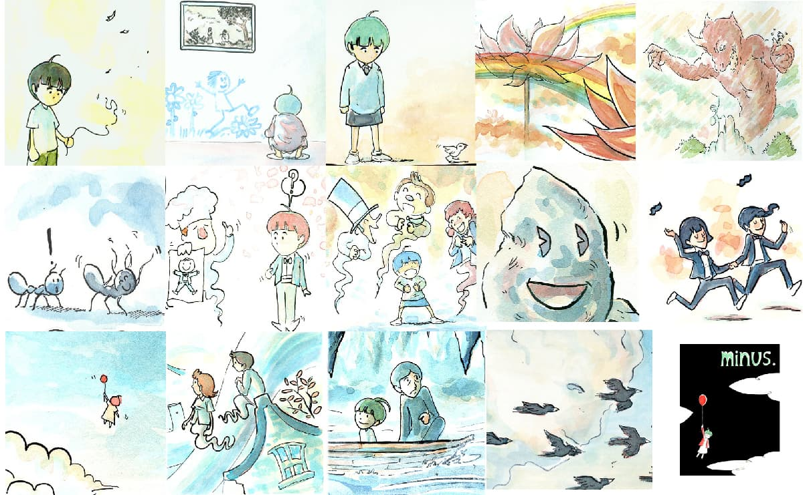

Ryan's notes from this series:

> Each minus strip is painted on a 15x20" piece of Illustration board. With this comic I am pretending I am making a comic strip for a newspaper in the early 20th century. A special newspaper that lets me use as much color as I want. I'm not much for comic strips so I don't know how long I'll be doing this one, so enjoy it while it lasts, I guess? It'll be updating every thursday until I suddenly stop! Making comics on giant paper is pretty neat though. Yeah.

To all appearances, this comic appears to be complete.
