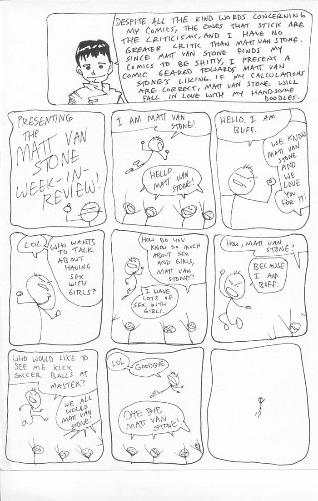

*Note: Ryan and I used to post on a video game forum. Another user there, Matt van Stone (who went by the handle MVS), critiqued some of Ryan's work and gave him a hard time. Ryan made this in response. MVS was also antagonistic toward another user, whose handle was Master.*

This comic is hastily drawn, its panels askew, and mainly stick figures.

1. A full-width panel with a non-stick figure cartoon Ryan saying, "Despite all the kind words concerning my comics, the ones that stick are the criticisms, and I have no greater critic than Matt van Stone. Since Matt van Stone finds my comics to be shitty, I present a comic geared towards Matt van Stone's liking. If my calculations are correct, Matt van Stone will fall in love with my handsome doodles."
2. A displeased stick figure holds up a middle finger, pointing at the words, "Presenting the Matt van Stone week-in-review!"
3. The displeased stick figure (MVS) flies above a crowd of four elated stick figures, shouting, "I am Matt van Stone." The crowd says, "Hello Matt van Stone!"
4. Stick figure MVS pumps his fist and says, "Hello. I am buff." The off-panel crowd says, "We know Matt van Stone and we love you for it!"
5. Stick figure MVS preens and says, "L O L," and then, "Who wants to talk about having sex with girls?"
6. The crowd says, "How do you know so much about sex and girls, Matt van Stone?" Stick figure MVS flies above them and replies, "I have lots of sex with girls."
7. The crowd asks, "How, Matt van Stone?" Stick figure MVS flexes and says, "Because I am buff."
8. Now slightly pleased with himself, stick figure MVS asks, "Who would like to see me kick soccer balls at Master?" The crowd replies, "We all would Matt van Stone!"
9. Flying toward the right side of the panel, stick figure MVS says, "L O L," and then, "Goodbye". The crowd shouts, "Bye bye Matt van Stone!"
10. No text, just a small stick figure MVS flying away.
