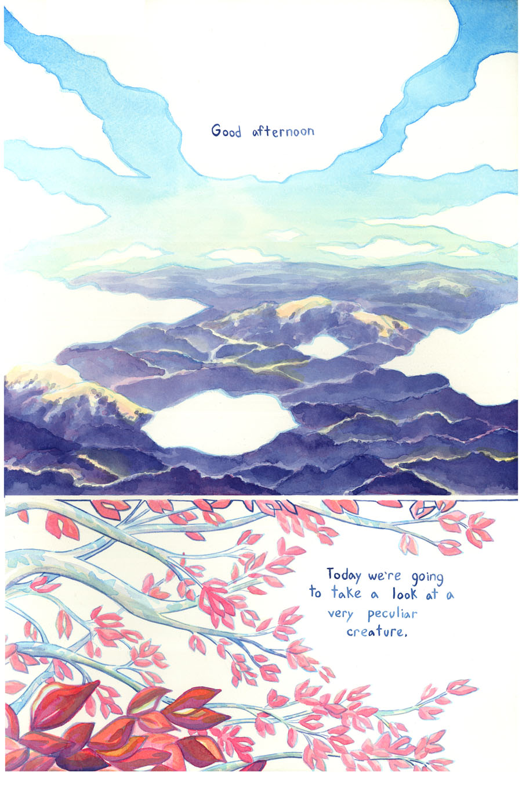
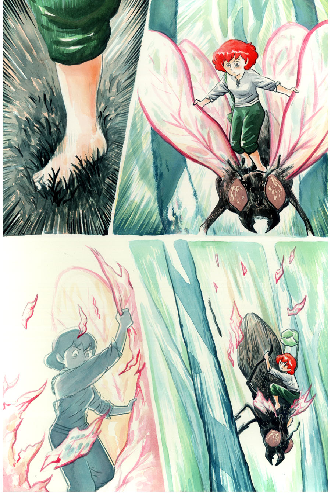

Ryan's art style for this comic is watercolor with fountain pen style lettering. The presentation is usually focused on the artwork, which draws the eye, before the narrator comments. Instead of a single comic image with panels, Ryan broke each installment into separate images (though some of those images *do* have panels).

1. Clouds float in a blue sky over a stunning vista of tree-covered hills, which are tinted purple. "Good afternoon," the narrator says.
2. White branches from a tree come from the left side of the panel, their red leaves casting shadows across the bark. The narrator says, "Today we're going to take a look at a very peculiar creature."
3. A closer view of the branches, which twist and curl around one another. Faint shadows of humanoids walk on a branch in the distance, and one looks to be sitting on another branch. "Can you see them?" the narrator asks.
4. An even closer view of a single branch amid some red leaves. The vague outline of a person stands on the branch.
5. "How about now?" the narrator asks. Zooming in further, with some leaves partially blocking the view, the person's face can be seen. It looks like a human with red-brown hair, wearing a white, short-sleeve shirt and green pants.
6. The person runs across the branch, between the leaves. The narrator says, "That's right, their peculiarity comes from their remarkable similarity to us."
7. A different person sits on the end of the branch, in a similar outfit with a hat. The first person runs toward them. "They look like us, they dress like us, and they even act a little bit like us," the narrator says. "For these remarkably peculiar creatures, we've come up with an equally peculiar name. We call them The Little People."
8. A full page view of the tree, amid the purple hills and many-colored flowers of the valley it's in. The narrator says, "The Little People of Millefille Valley."
9. Back in the branches are three different Little People. From left to right: A middle-aged man, crouching, in a flat cap, with a white shirt and dark blue pants. A young woman with neck-length red hair, a grey shirt with the sleeves rolled up, and dark green pants, looking concerned about something below her. Another young woman, with green hair, wearing a light green dress and blue pants, a mischievous look on her face with her hands in the air. All three have green satchels. The narrator says, "Today we're going to take a look at the every day life of one such Little Person."
10. "Her first name is Pelen," the narrator continues. "Her last name is Purul." The panel is a close-up of the red-haired young woman, who is looking up and away now.
11. Pelen darts away along the branch as the narrator says, "Let's begin."
12. Pelen leaps off the branch, free-falling between the red leaves and branches of the tree.
13. A cover image with the full title, "The Mildly Inconvenient Journey of Pelen Purul." Instead of the usual vibrant colors, this one is a sepia-tone of Pelen as she falls, her hands and legs buffeted by the wind, her bag flapping, a smile on her face.
14. Pelen walks across another branch. The narrator says, "Pelen's leaping from branch to branch may seem a bit wreckless to humble ground walkers like ourselves, but, like most Little People, she is extremely agile and knows exactly what she is doing."
15. Pelen crouches atop a green centipede, looking around warily as the insect traverses the branch.
16. Pelen leaps off the centipede, this time holding onto her bag as she falls and looking down in anticipation.
17. As Pelen falls, a bird flies into the frame. Though the focus is on the bird's details, Pelen's posture indicates she's surprised by the bird's presence.
18. Pelen lands on the bird's back and holds on for dear life.
19. A wide shot of the sky, the bird flying high in the distance. The narrator says, "Perhaps I spoke too soon."
20. Pelen now looks worried as she scans around from the bird's back.
21. She turns her head, still not able to find what she's looking for.
22. As the bird soars away, Pelen drops into a patch of flowers, where some dragonflies and grubs are living.
23. Pelen clings to a flower's stalk, looking at the sky. The narrator says, "Having survived her sudden flight, Pelen now finds herself stranded far away from her home in the Millefille Valley. Returning safely may be next to impossible. An unfortunate turn of events for her, but a great opportunity for us to see how well she can survive on her own in the wild."
24. Pelen swings her head around to see a dragonfly approaching her.
25. Pelen leaps from the flower stalk, toward the dragonfly.
26. Her foot plants down forcefully on the bug's back.
27. Standing atop the dragonfly, Pelen grabs its front two wings as though she can control it that way.
28. A blue-tinted Pelen tears the dragonfly's wings off.
29. The dragonfly plummets, with Pelen still clinging to its back.
30. When the bug crashes into the ground, Pelen leaps, and pulls one of its legs off with her.
31. The dragonfly lays on the ground, motionless.
32. Holding the bug's leg across her shoulders, Pelen speaks to the bug. Little People speech bubbles are jagged, with red outlines. The words are unintelligible glyphs, also in red.
33. Pelen kicks the dragonfly's head, and says two different things to it - almost as though she is taunting it. The narrator remarks, "Perhaps she'll be fine."
