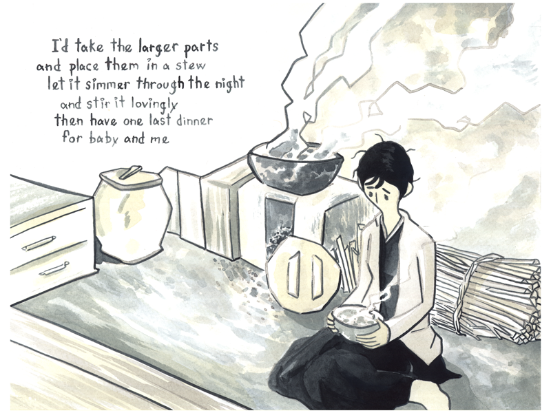

<figure>

<figcaption>
Ryan's style for this comic employs only shades of grey and faint yellow, with dark grey lettering. Each image is its own panel.

1. Some sort of figure is dashed across the ground, almost as though it were ceramic. Pieces of a head with hair are visible, as well as a black and grey striped robe tied with a white sash. The text reads: "If baby fell apart, what would you do?"
2. A person sits on the floor of a small, Japanese-style kitchen. A large bowl sits atop a stove, its contents steaming. The person looks sadly at a smaller bowl they hold in their lap. The text reads: "I'd take the larger parts and place them in a stew, let it simmer through the night and stir it lovingly, then have one last dinner for baby and me."
3. The person, in a maid's outfit, uses a hand broom and sweeps debris into a dustpan. The text reads: "Once the larger parts are gone, what would you do?"
4. A panoramic vista of the person standing on the shore of a lake, looking out over the water as clouds gather. The text reads: "I'd take the smaller parts and place them in my shoes, grind them til' they're nice and smooth, then head out to the sea and have one last walk for baby and me."
</figcaption>
</figure>
