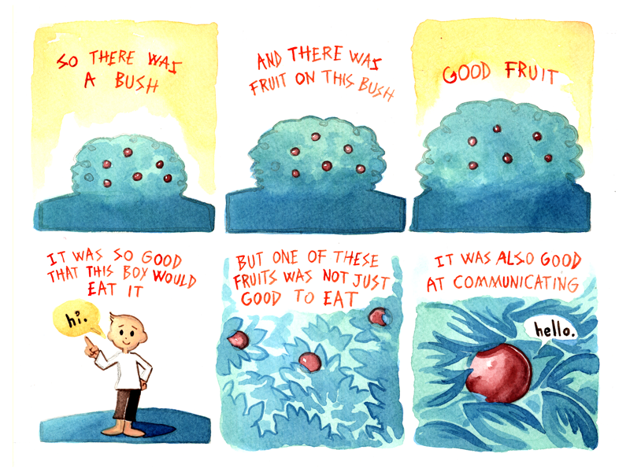
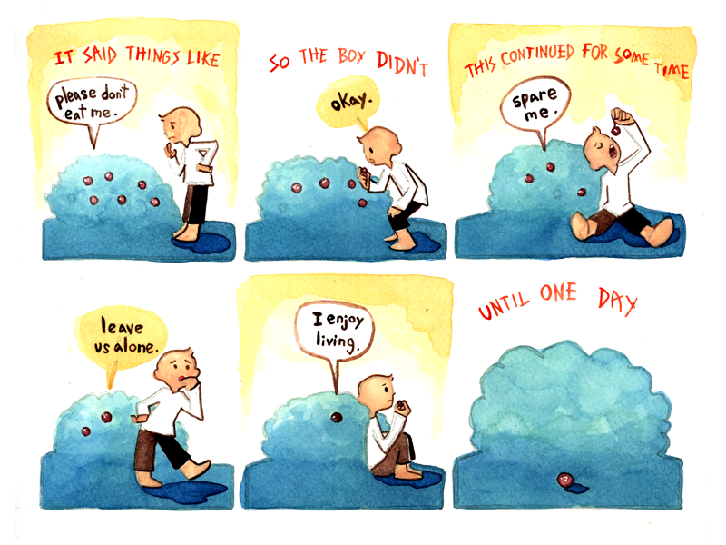

Ryan used his watercolor style, with vibrant colors for this comic. This one has a more standard newspaper comic appearance, even though the panels don't have border lines. A narrator's words are red, all in caps, stylized with sharp points. The characters have speech bubbles with dark brown ink, with a more whimsical font style. Each image has multiple panels.

1. A small bush is shown, with six red berries on it. The narrator says, "So there was a bush."
2. A very slightly closer view of the bush. The narrator says, "And there was fruit on this bush."
3. Even closer to the bush. The narrator says, "Good fruit."
4. A boy in a white shirt and brown pants, with one hand on his hip and the other pointing to emphasize something. The narrator says, "It was so good that this boy would eat it." The boy says, "Hi."
5. A closeup shot of three berries among the bush's leaves. The narrator says, "But one of these fruits was not just good to eat."
6. Zoomed in on a single berry, amid the leaves. The narrator says, "It was also good at communicating." The berry says, "Hello."
7. The boy ponders the fruit on the bush. The narrator says, "It said things like," and the berry says, "Please don't eat me."
8. The boy eats a different berry and leans forward to pick another off, leaving four. The narrator says, "So the boy didn't," and the boy says, "Okay."
9. The boy sits on the ground, dangling a third berry over his mouth. Three remain on the bush. The narrator says, "This continued for some time." The berry says, "Spare me."
10. Two berries remain on the bush, and the boy looks to be pondering something. The berry says, "Leave us alone."
11. The boy again sits on the ground, ready to eat a fifth berry. Only the special one remains, and it says, "I enjoy living."
12. The bush is empty, and the berry is on the ground. The narrator says, "Until one day."
13. The boy stands over the berry. It says, "Please don't eat me." The boy replies, "But you are the only thing to eat."
14. The berry says, "Even so, do not eat me." The boy retorts, "But you have fallen off the bush."
15. A closeup of the berry on the grass. It says, "Yes, but if I can survive for just one more day, I will gain immense power."
16. The berry continues, "Help me make it through the night, and tomorrow I will use my power to reward you for all the kindness you've shown me."
17. The boy walks off, carrying the berry. The narrator says, "So the boy took the fruit home."
18. The boy proudly holds the berry up to his mother, father, and younger sister, who all wear similar white and brown clothing as him. The narrator says, "He introduced it to his family."
19. The berry sits in a small dish on a counter. The narrator says, "Gave it a place to rest."
20. A nighttime silhouette of a house. The narrator says, "And went to sleep."
21. The boy sits at a table laden with three bowls and two platters of food. The appearance of the food is reminiscent of meat, though a small bowl looks to contain soup. The berry is at the end of the table. The narrator says, "The next morning he awoke to a great feast that the fruit had prepared for him." The berry says, "Surprise."
22. The boy shovels some small, circular food items into his mouth from one of the bowls. The narrator says, "Quite the fan of feasts, the boy dove right in."
23. The boy eats a piece of food from one of the platters. He says, "This is delicious! Where is my family? I would like to share it with them!" and the berry plainly replies, "This **is** your family."
24. No text, just a white silhouette of the boy with an exclamation mark above his head.
25. A close up of the berry as it says, "I was forced to watch as my loved ones were devoured before my eyes. Today I will watch yours. Tell me, how delicious is your meal now that you know the truth?"
26. The boy looks at the the piece of food he's holding. The narrator says, "With that, the boy realized how cruel he had been, and the folly of expecting to be rewarded for it."
27. The boy holds his hand in front of his mouth. The narrator says, "Then he took one more bite and said," and the boy finishes, "While I realize my mistake and mourn the loss of my family..."
28. The boy lifts a finger and closes his eyes solemnly, saying, "This delicious food remains delicious."
29. Just text, reading, "Moral: On their own merits judge all things."
